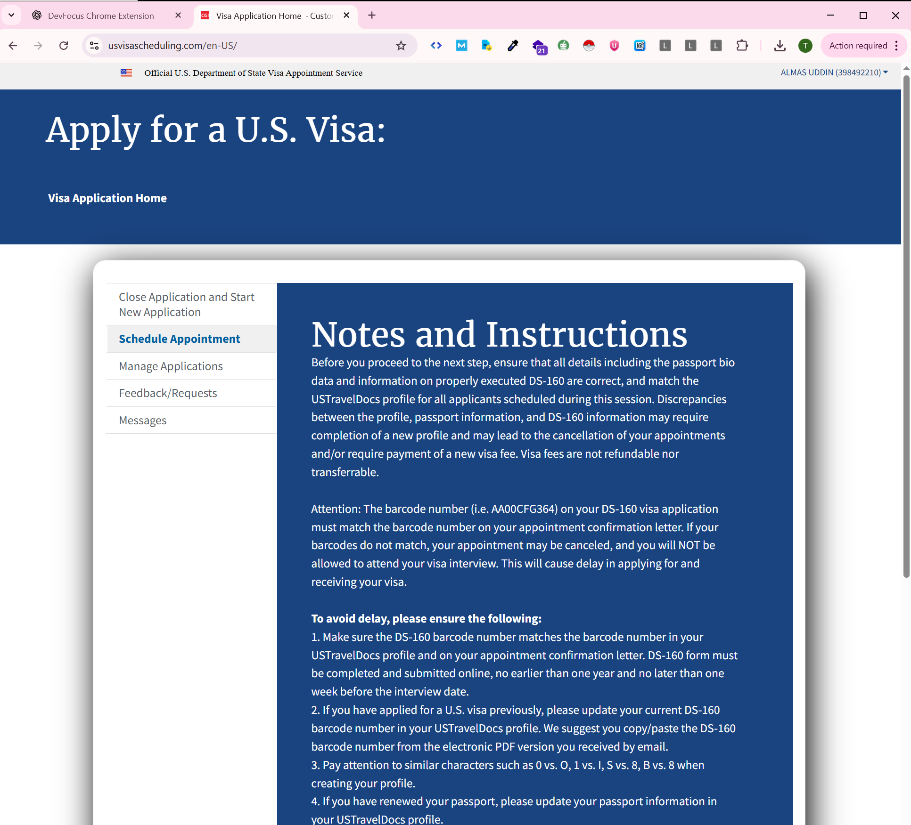
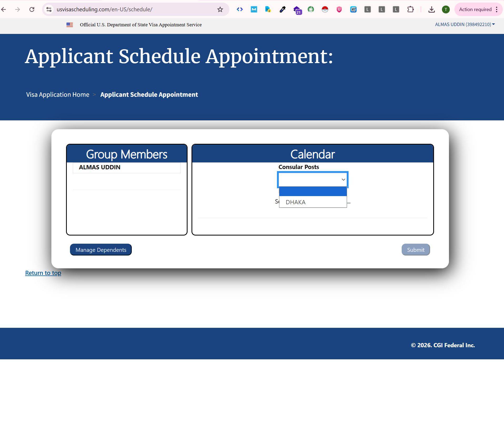
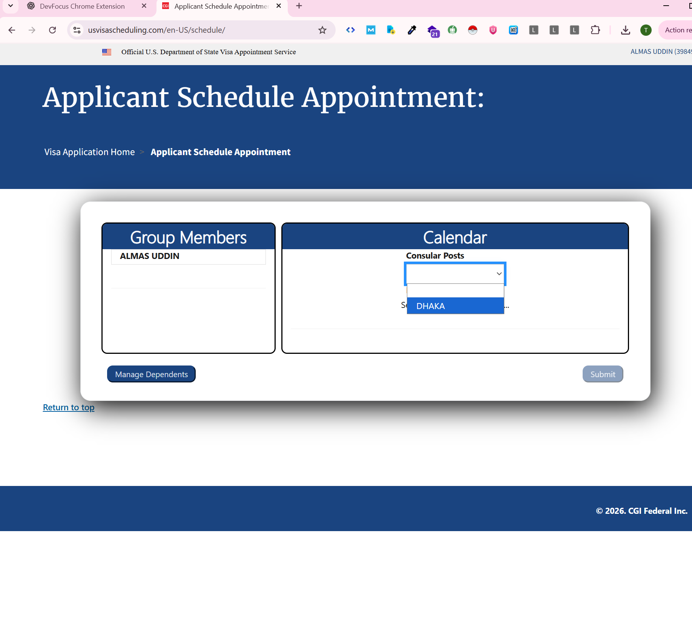
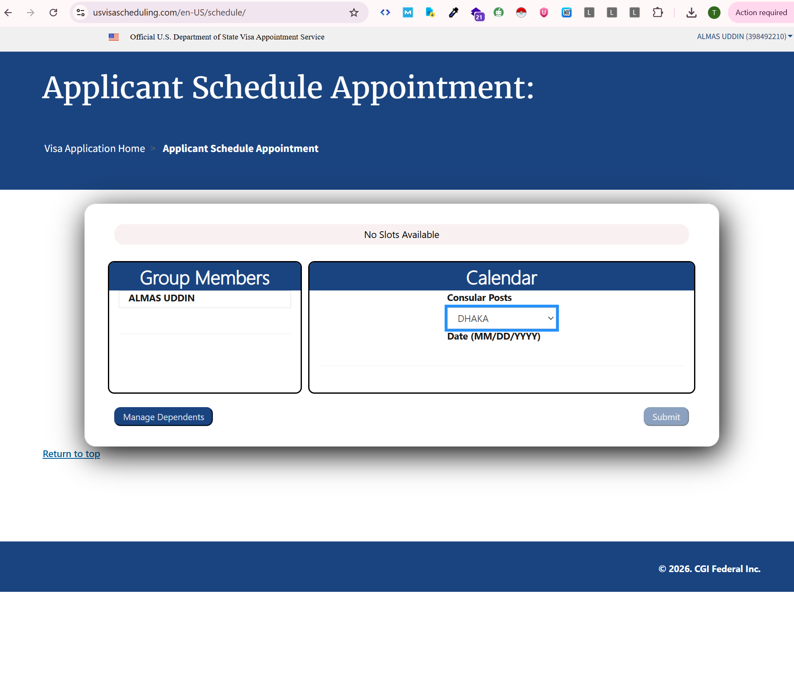

# 🤖 US Visa Appointment Scheduler Bot

> A Chrome Extension that **automates US visa appointment slot monitoring** on [usvisascheduling.com](https://www.usvisascheduling.com). It runs a continuous check loop, detects available appointment slots using multi-layer DOM analysis, and sends real-time Gmail notifications — all with precise, configurable timing control.

---

## 📋 Table of Contents

- [Project Overview](#-project-overview)
- [Features](#-features)
- [Tech Stack](#-tech-stack)
- [How It Works](#-how-it-works)
- [Slot Detection Logic](#-slot-detection-logic)
- [Timing & Notification System](#-timing--notification-system)
- [File Structure](#-file-structure)
- [Installation & Setup](#-installation--setup)
- [Usage](#-usage)
- [Screenshots](#-screenshots)
- [Configuration](#-configuration)
- [Technical Deep Dive](#-technical-deep-dive)

---

## 📌 Project Overview

Getting a US visa appointment in DHAKA is extremely competitive — slots open and fill within seconds. This bot solves that problem by continuously and automatically monitoring the official scheduling site, checking both page-level messages and the appointment calendar's DOM state to reliably detect when slots become available, then instantly notifying you via Gmail.

The extension was built with a focus on three core challenges:

1. **Precise timing** — cycle and notification intervals must run at exactly the user-specified duration, even across page navigations and reloads.
2. **Accurate slot detection** — the site's "No Slots Available" message does not always appear, so the bot performs a secondary deep DOM inspection of the jQuery UI datepicker calendar.
3. **Persistent state** — all timing data is stored in `chrome.storage.local` so it survives page reloads that happen every cycle.

---

## ✨ Features

- **Automated Loop Cycling** — continuously navigates the site, selects the DHAKA consular post, and checks for slots at a precise user-defined interval
- **Two-Layer Slot Detection** — first checks for the "No Slots Available" banner text; if absent, parses every date cell in the appointment calendar to verify actual availability
- **Instant Slot-Available Alerts** — the moment a real slot is detected, a Gmail notification fires immediately with zero cooldown delay
- **Configurable Email Cooldown** — "No Slots" status emails are throttled to a separate user-defined interval (e.g., every 200 seconds) to prevent inbox spam
- **Persistent Timing Across Reloads** — all cycle and notification timestamps are stored in `chrome.storage.local`, so the bot maintains its exact schedule even when the page navigates between the home page and the scheduling page every cycle
- **Auto-Resume on Reload** — if the bot was running before a page reload, it automatically restores its configuration and continues from where it left off
- **Multi-Recipient Email Support** — enter multiple comma-separated email addresses; all recipients receive the notification
- **Real-Time Status Display** — the popup shows live status including a countdown to the next email notification
- **Browser Notification Backup** — a Chrome desktop notification fires alongside the Gmail compose, ensuring you never miss an alert
- **Comprehensive Console Logging** — every action, timing check, and decision is logged with clear categories for easy debugging

---

## 🛠️ Tech Stack

| Category | Technologies |
|---|---|
| **Runtime** | Chrome Extension Manifest V3 |
| **Core Scripts** | JavaScript (ES2017+ async/await) |
| **DOM Manipulation** | `querySelector`, `querySelectorAll`, jQuery UI Datepicker parsing |
| **State Management** | `chrome.storage.local` (persistent across page loads) |
| **Messaging** | `chrome.runtime.onMessage` / `chrome.tabs.sendMessage` |
| **Notifications** | Chrome Notifications API + Gmail Compose automation |
| **Permissions** | `activeTab`, `storage`, `tabs`, `notifications`, `scripting` |

---

## 🔄 How It Works

The bot operates in a repeating cycle. Each cycle navigates two pages on the visa scheduling site:

### Cycle Flow

```
┌─────────────────────────────────────────────────────────┐
│                    START / RESUME                        │
│         (reads timing state from chrome.storage)        │
└────────────────────────┬────────────────────────────────┘
                         │  wait exactly N seconds
                         ▼
┌─────────────────────────────────────────────────────────┐
│  PAGE 1 — Home Page  (usvisascheduling.com/en-US/)      │
│                                                         │
│  Bot clicks → "Schedule Appointment" link               │
│  Selector: #continue_application                        │
│  Waits 2s for navigation                                │
└────────────────────────┬────────────────────────────────┘
                         ▼
┌─────────────────────────────────────────────────────────┐
│  PAGE 2 — Schedule Page  (.../en-US/schedule/)          │
│                                                         │
│  1. Selects "DHAKA" from Consular Posts dropdown        │
│     Selector: #post_select                              │
│     Value: 906af614-b0db-ec11-a7b4-001dd80234f6        │
│     Dispatches 'change' event → waits 3s                │
│                                                         │
│  2. Runs slot detection (see below)                     │
│                                                         │
│  3. Navigates back to Home Page → cycle repeats         │
└─────────────────────────────────────────────────────────┘
```

### Screenshot Reference — Each Step

**Step 1 — Home page, bot clicks "Schedule Appointment":**



**Step 2 — Schedule page loads, bot opens the Consular Posts dropdown:**



**Step 3 — Bot selects DHAKA:**



**Step 4 — Page updates, bot reads the result (example: no slots):**



---

## 🔍 Slot Detection Logic

This is the most technically interesting part of the project. The site has an inconsistency: sometimes it displays a clear "No Slots Available" banner, but other times it skips that banner entirely and instead renders a full calendar where every single date is marked unavailable. A naive check on the banner text alone would incorrectly report slots as available in the second case.

The solution is a **two-step detection pipeline**:

### Step 1 — Page Text Check

```
Scan full page text for "No Slots Available"
        │
        ├── FOUND  →  ❌ No slots. Done.
        │
        └── NOT FOUND  →  Proceed to Step 2
```

If the banner text exists anywhere in the page body, the decision is immediate — no slots.

### Step 2 — Calendar DOM Inspection

When the banner is missing, the bot parses the jQuery UI Datepicker calendar rendered on the page. It locates the `#datepicker` container and inspects every `<td>` element representing a date:

```
Find #datepicker container
        │
        ├── NOT FOUND  →  ❌ No slots (safe default)
        │
        └── FOUND
                │
                ▼
        Scan all <td> date cells
        Exclude cells with class: ui-datepicker-other-month
                │
                ▼
        A date is UNAVAILABLE if ANY of these are true:
          • has class "redday"
          • has class "ui-state-disabled"
          • has title="No Available Appointments"
                │
                ▼
        A date is AVAILABLE only if NONE of the above apply
                │
                ├── Available dates > 0  →  ✅ Slots available!
                └── Available dates = 0  →  ❌ No slots
```

#### Why the safe default when calendar is missing

If neither the banner text nor the calendar element is found on the page — for example during a page transition or an unexpected layout — the bot defaults to "no slots". This prevents false-positive alerts. A false positive (claiming slots exist when they don't) wastes time and creates alert fatigue. A false negative (missing real slots for one cycle) is far less costly because the bot will catch them on the next cycle seconds later.

#### Calendar HTML Structure (for reference)

Each unavailable date in the datepicker looks like this:

```html
<td class="ui-datepicker-unselectable ui-state-disabled redday"
    title="No Available Appointments">
  <span class="ui-state-default">15</span>
</td>
```

An available date would lack `redday`, `ui-state-disabled`, and the "No Available Appointments" title.

#### All Detection Scenarios

| # | "No Slots" Banner | Calendar State | Result |
|---|---|---|---|
| 1 | ✅ Found | — (not checked) | ❌ No Slots |
| 2 | ❌ Not found | ❌ Calendar not found | ❌ No Slots (safe default) |
| 3 | ❌ Not found | All dates red / disabled | ❌ No Slots |
| 4 | ❌ Not found | At least one date available | ✅ **Slots Available** |

---

## ⏱️ Timing & Notification System

### The Problem This Solves

Every cycle, the bot navigates away from the schedule page back to the home page. This reloads the content script and destroys all JavaScript variables. A naive `setInterval` or in-memory timestamp would reset to zero on every reload, making the bot run every cycle instantly instead of waiting.

### The Solution — `chrome.storage.local`

All timing state is persisted in Chrome's local storage, which survives page loads:

| Key | Purpose |
|---|---|
| `nextCycleTime` | Exact timestamp (ms) when the next cycle should fire |
| `lastCycleTime` | Timestamp of the most recent cycle |
| `lastNoSlotsEmailTime` | Timestamp of the last "no slots" email sent |
| `lastSlotsAvailableEmailTime` | Timestamp of the last "slots available" email sent |
| `cycleCounter` | Running count of total cycles executed |

A 1-second polling loop reads `nextCycleTime` from storage on every tick. The cycle only fires when `Date.now() >= nextCycleTime`. After firing, it writes the new `nextCycleTime = now + interval` back to storage before the page navigates.

### Notification Cooldown Rules

| Condition | Email Behavior |
|---|---|
| Slots **available** | Sent **immediately** — zero cooldown, regardless of when the last email was sent |
| Slots **not available** (first check ever) | Sent immediately — there is no previous timestamp to compare against |
| Slots **not available** (subsequent checks) | Sent only after the user-configured notification interval has elapsed since the last "no slots" email |

### Timing Example

```
Settings: Loop Cycle = 50s, Email Notification = 200s

Time 0:00  →  Cycle 1  →  No slots  →  ✉️ Email sent (first notification)
Time 0:50  →  Cycle 2  →  No slots  →  ⏳ Cooldown (150s remaining)
Time 1:40  →  Cycle 3  →  No slots  →  ⏳ Cooldown (100s remaining)
Time 2:30  →  Cycle 4  →  No slots  →  ⏳ Cooldown (50s remaining)
Time 3:20  →  Cycle 5  →  No slots  →  ✉️ Email sent (200s elapsed)
Time 4:10  →  Cycle 6  →  SLOTS!    →  ✉️ Email sent IMMEDIATELY ⚡
                                         Bot stops automatically
```

---

## 📁 File Structure

```
US-Visa-Scheduler-Bot/
│
├── manifest.json          # Chrome extension manifest (v3), permissions, content script config
├── popup.html             # Extension popup UI — inputs for email, intervals; start/stop buttons
├── popup.js               # Popup logic — validation, storage read/write, message passing to content script
├── background.js          # Service worker — handles Chrome desktop notifications
├── content.js             # Main bot logic — cycle loop, slot detection, email cooldown, auto-resume
└── gmail-composer.js      # Gmail content script — auto-fills compose window with pending email data
```

### Role of Each File

**`manifest.json`** declares the extension. It registers `content.js` to run on `usvisascheduling.com` and `gmail-composer.js` to run on `mail.google.com`. It requests `storage`, `notifications`, `tabs`, and `activeTab` permissions.

**`popup.html` / `popup.js`** provide the user interface. The user enters email addresses, the loop cycle interval, and the email notification interval. On clicking Start, `popup.js` validates inputs, saves them to `chrome.storage.local`, and sends a message to the content script to begin.

**`content.js`** is the core. It listens for start/stop messages, runs the cycle loop with persistent timing, performs the two-layer slot detection, manages email cooldown logic, and opens Gmail compose tabs when a notification is due.

**`background.js`** is a lightweight service worker that creates Chrome desktop notifications as a backup alert channel alongside Gmail.

**`gmail-composer.js`** runs on Gmail pages. When the bot opens a new compose tab, this script reads the pending email data from `chrome.storage.local` and auto-fills the To, Subject, and Body fields, then clicks Send.

---

## 📦 Installation & Setup

### Prerequisites

- Google Chrome browser
- A Google account (logged into Gmail in the same Chrome profile)
- An account on [usvisascheduling.com](https://www.usvisascheduling.com) (you log in manually)

### Steps

1. **Download or clone this repository**

```bash
git clone https://github.com/seotanvirbd/US-Visa-Scheduler-Bot.git
cd US-Visa-Scheduler-Bot
```

2. **Open Chrome's extension manager**

```
chrome://extensions/
```

3. **Enable Developer Mode** — toggle it on in the top-right corner

4. **Load the extension** — click "Load unpacked", then select the project folder

5. **Pin the extension** — click the pin icon next to the extension name so the popup is always accessible

---

## 🚀 Usage

1. **Log into Gmail** in Chrome — the bot sends emails through your own Gmail account

2. **Navigate to** [usvisascheduling.com](https://www.usvisascheduling.com) and **log in manually**

3. **Click the extension icon** in the toolbar to open the popup

4. **Fill in the configuration:**
   - **Email(s)** — your notification email(s), comma-separated if multiple
   - **Loop Cycle Interval** — how often (in seconds) the bot checks for slots (recommended: 30–60s)
   - **Email Notification Interval** — how often (in seconds) "No Slots" emails are sent (recommended: 150–300s)

5. **Click "Start Bot"** — the bot begins its automated cycle

6. **Monitor** — watch the status bar in the popup for live updates, or open DevTools (`F12` → Console) for detailed logs

7. **Click "Stop Bot"** at any time to halt the bot

---

## 📸 Screenshots

### Home Page — Starting Point

The bot begins here and automatically clicks "Schedule Appointment" in the left sidebar.


### Consular Posts Dropdown

After navigating to the schedule page, the bot opens the dropdown to select the consular post.


### DHAKA Selection

The bot programmatically selects DHAKA and triggers the change event to load the calendar.


### Slot Check Result

After DHAKA loads, the bot reads the page state. Here it shows "No Slots Available" — the bot logs this, applies the email cooldown check, and navigates back to repeat the cycle.


---

## ⚙️ Configuration

| Setting | Min | Max | Default | Description |
|---|---|---|---|---|
| Email(s) | 1 | unlimited | — | Comma-separated list of notification email addresses |
| Loop Cycle Interval | 10s | 300s | 50s | How often the bot runs one full check cycle |
| Email Notification Interval | 30s | 3600s | 200s | Cooldown between consecutive "No Slots" emails |

**Note:** "Slots Available" emails always send immediately regardless of the notification interval setting.

---

## 🔧 Technical Deep Dive

### Precise Timing Across Page Navigations

The most subtle engineering challenge in this project is keeping the cycle timer accurate across page reloads. The schedule page and the home page are separate URLs — the bot must navigate between them every cycle, which destroys and recreates the content script each time.

The solution: instead of relying on `setInterval` duration, the bot stores the **absolute timestamp** of when the next cycle should run. On each 1-second tick, it compares `Date.now()` against that stored target. This means even if the script restarts due to navigation, it simply reads the target from storage and waits only the remaining time.

```javascript
// Every second:
chrome.storage.local.get(['nextCycleTime'], (result) => {
  if (Date.now() >= result.nextCycleTime) {
    // Time to run. Save next target before navigating.
    chrome.storage.local.set({ nextCycleTime: Date.now() + interval });
    runBotCycle();
  }
});
```

### Gmail Auto-Compose via Content Script

The bot does not use any email API or SMTP. Instead, it stores the email payload in `chrome.storage.local`, opens a Gmail compose tab, and injects a content script (`gmail-composer.js`) that runs on `mail.google.com`. That script detects when the compose window is ready, reads the payload, fills the fields programmatically, and clicks Send.

### Auto-Resume Logic

When the page reloads (which happens every cycle), the content script checks `chrome.storage.local` for a `botRunning: true` flag. If found, it restores the full configuration — email, intervals, timing targets — and resumes the polling loop after a 2-second delay to let the page finish loading.

### Concurrency Guard

An `isChecking` flag prevents multiple cycle executions from overlapping. If the previous cycle's async operations (page navigation, sleep, DOM reads) are still in progress when the next tick fires, the tick is skipped.

---

## 📝 Key Technical Skills Demonstrated

- **Chrome Extension Architecture (Manifest V3)** — service workers, content scripts, popup scripts, message passing between all three contexts
- **Persistent State Management** — using `chrome.storage.local` to maintain timing accuracy across page reloads instead of relying on volatile in-memory variables
- **DOM Parsing & Web Automation** — programmatic element selection, event dispatching, and multi-selector fallback strategies for interacting with a third-party website
- **Asynchronous Control Flow** — async/await with precise timing, concurrency guards, and cooldown state machines
- **Gmail Automation** — injecting content into Gmail's compose UI via a content script without using any external API

---

## 👨‍💻 About the Author

**Mohammad Tanvir** — Python Web Scraping & AI Automation Specialist

| Platform | Link |
|---|---|
| Portfolio | [seotanvirbd.com](https://seotanvirbd.com) |
| GitHub | [github.com/seotanvirbd](https://github.com/seotanvirbd) |
| Upwork | 100% Job Success Rate |
| Email | tanvirafra1@gmail.com |

---

*Built to solve a real-world problem: securing a US visa appointment in DHAKA when slots are scarce and disappear in seconds.*
